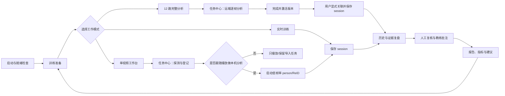

# iSkating 全量功能盘点与客户端流程重构

更新时间：2026-07-20
配套原型：[client-flow-prototype.html](client-flow-prototype.html)

## 1. 盘点范围与结论口径

本次盘点覆盖 Windows Qt 客户端、FastAPI/PostgreSQL 服务、Ubuntu DeepStream worker、模型与数据工具、测试和运维文档。结论以当前源码、项目文件和自动测试为准；文档或历史任务记录与代码不一致时，以代码为准。

状态定义：

- **当前可用**：在活跃构建中、有用户入口且主交互路径已接通；不表示脱离训练服务和业务数据仍能离线运行。
- **条件可用**：代码和入口已实现，但结果依赖摄像头、GPU、模型、标定、身份数据、NAS 或 DeepStream worker 等附加条件。
- **兼容能力**：用于读取、复核或导出历史数据；当前实时链路不再生成这类数据。
- **支撑能力**：服务端、worker、脚本或部署能力，不直接出现在客户端导航。
- **未接入**：仓库中仍有源码或模型资产，但未进入当前构建或没有用户入口，不能算当前产品功能。
- **边界**：代码已存在但有已知缺口、语义偏差或未完成端到端验证，界面不应超出实际能力承诺。

核心事实只有一句话：当前 Windows 实时主链路是 **人体检测 + ReID 身份识别 + 机位内 track + 条件式二维轨迹/速度**；它不生成新的姿态关键点、3D 骨架、自动动作计数或自动技术评分。

下表共盘点 **143 个编号项**，同时包含可用功能、历史兼容能力、后台支撑能力和已知边界；不会把“有源码但未接入”计为已上线功能。

## 2. 全量功能清单

### 2.1 应用外壳与通用交互

| 编号 | 状态 | 已实现功能 | 代码依据 |
|---|---|---|---|
| A-01 | 当前可用 | Windows 桌面应用启动时优先使用程序目录中的 Qt 插件和运行库，并以最大化窗口打开。 | `main.cpp` |
| A-02 | 当前可用 | 暗色训练仪表盘主题、Qt 资源图标、静态图片和统一按钮状态样式。 | `styles/iskating.qss`, `iskating.qrc`, `iconutils.cpp` |
| A-03 | 当前可用 | 当前主窗口有“运动员检测”“训练历史与分析”“动作纠正与建议”三页导航。 | `mainwindow.ui`, `MainWindow::switchPage()` |
| A-04 | 当前可用 | 侧栏折叠/展开、按钮悬停提示、固定宽度操作栏，避免布局抖动。 | `MainWindow::toggleSidebar()`, `eventFilter()` |
| A-05 | 当前可用 | F11/按钮进入或退出全屏，Esc 退出全屏。 | `MainWindow::toggleFullScreen()`, `exitFullScreenMode()` |
| A-06 | 当前可用 | 主视频显示当前来源；双击任一机位缩略图切换主视图。 | `selectCamera()`, `showCameraInMainView()` |
| A-07 | 当前可用 | 开始、暂停、停止、保存记录和系统设置使用独立操作按钮，并提供 tooltip、statusTip 和 accessibleName。 | `MainWindow` 构造函数 |
| A-08 | 当前可用 | 模型状态、训练服务/数据状态、最近保存、文件缺失、任务失败等通过顶部或页面提示反馈。 | `refreshModelStatus()`, `initializeTrainingRepository()` |
| A-09 | 边界 | 顶部“训练轮次、日期时间、系统状态”目前是静态展示文案，不是动态业务状态；模型和 DB 状态才会动态刷新。 | `MainWindow::MainWindow()` |

### 2.2 人员、身份、比赛与训练资料

| 编号 | 状态 | 已实现功能 | 代码依据 |
|---|---|---|---|
| B-01 | 条件可用 | 客户端启动时检查训练服务健康状态，使用已有 token 或账号密码自动登录；当前没有用户可见登录页。 | `TrainingRepository::open()`, `login()` |
| B-02 | 当前可用 | 运动员档案新增、编辑、列表和归档；字段包括姓名、编号、年龄组、身高、体重、项目、等级、惯用旋转、起跳脚、伤病限制和训练目标。 | `personmanagementdialog.cpp` |
| B-03 | 当前可用 | 训练现场可快速新增运动员或教练，也可进入完整人员管理页。 | `addAthleteFromDialog()`, `addCoachFromDialog()`, `openPersonManagement()` |
| B-04 | 当前可用 | 教练档案新增、编辑、列表和归档；字段包括编号、专项、电话和备注。 | `personmanagementdialog.cpp` |
| B-05 | 当前可用 | 维护教练与可带训运动员的多选关系。 | `PersonManagementDialog::saveCoach()` |
| B-06 | 条件可用 | 为运动员添加 JPG/JPEG/PNG/WebP/BMP ReID 样本，查看文件、向量维度和版本，删除样本。 | `addIdentitySample()`, `deleteIdentitySample()` |
| B-07 | 条件可用 | 添加样本时在 Windows 端运行 PersonViT，保存 768 维 embedding、模型版本和预处理版本。 | `TensorRtAthleteBackend`, `saveIdentityEmbedding()` |
| B-08 | 条件可用 | gallery 只加载与当前模型/预处理版本一致的 embedding；模型升级后旧向量不会误用。 | `identityGallery()`, `reloadAthleteIdentityGallery()` |
| B-09 | 当前可用 | 一次 session 可选择主运动员和最多 3 名附加参与者，共最多 4 人。 | `installTrainingContextPanel()`, `currentSessionParticipants()` |
| B-10 | 当前可用 | 将当前机位 track 人工绑定到 session 参与者，作为 unknown、ambiguous 或低置信度识别的兜底。绑定只在当前内存会话有效，参与者/gallery 重载或保存后会清空。 | `editManualIdentityBindings()` |
| B-11 | 当前可用 | 比赛新增、编辑、查询和归档，维护名称、地点、日期、类型和备注。 | `openCompetitionManagement()` |
| B-12 | 当前可用 | 比赛场次/项目/轮次/分组新增、编辑和归档，维护计划时间与备注。 | `openCompetitionManagement()` |
| B-13 | 当前可用 | 维护场次参赛运动员、参赛号、道次、顺序、成绩、名次和备注。 | `openCompetitionManagement()` |
| B-14 | 当前可用 | 编辑已有动作标准：目标次数/分数、组数、休息、阈值、权重、最低分、阶段、关键点、问题与纠正提示。保存后版本号递增。 | `editActionStandard()`, `saveActionStandard()` |
| B-15 | 当前可用 | 为动作标准选择本地参考视频和说明，复盘时支持并排播放标准参考。schema/API 预留 `referenceRepetitionId`，但客户端没有选择参考动作实例的 UI。 | `TrainingReviewDialog`, `referenceRepetitionId` |
| B-16 | 当前可用 | 训练上下文保存运动员、教练、比赛/场次、动作标准、场地、阶段、目标、次数、目标分、组数、休息和训练备注。 | `installTrainingContextPanel()`, `saveRecord()` |
| B-17 | 支撑能力 | 服务端可按日确保训练计划/训练任务，但当前主窗口没有调用 `ensureDailyTask()`，不能当作已完成的客户端计划页。 | `POST /training/tasks/ensure-daily`, `TrainingRepository::ensureDailyTask()` |
| B-18 | 边界 | 客户端只能选择和编辑已有动作标准，没有新增或归档标准的入口；版本递增也不会保存一份不可变的旧标准快照。 | `editActionStandard()`, 服务端 action standard API |

### 2.3 摄像头、视频与系统设置

| 编号 | 状态 | 已实现功能 | 代码依据 |
|---|---|---|---|
| C-01 | 当前可用 | 统一配置 RTSP 账号、密码、端口、预览路径/FPS、主码流路径/FPS和 NVR 回放模板。 | `SystemSettingsDialog` |
| C-02 | 当前可用 | 分别维护 12 路相机 IP。公共参数和机位 IP 自动组装为脱敏日志可用的 RTSP URL。 | `composeCameraUrl()`, `safeUrlForLog()` |
| C-03 | 当前可用 | 每路配置是否参与轨迹、用途、场地起止距离、横向偏移、安装高度、朝向、俯仰、质量备注和兼容备注。`trajectoryEnabled=false` 也会让该 RTSP 机位不进入当前 AI 分析输入，它不只是绘图开关。 | `CameraSlotSettings`, `syncAnalysisStreams()` |
| C-04 | 当前可用 | 每路维护四组像素点与场地米制坐标，校验点集不共线，用于单应性投影。 | `SystemSettingsDialog` 四点标定 |
| C-05 | 当前可用 | 配置快速/平衡/高精度档位、分析流来源、目标 FPS、最大分析路数和非主机位自动降级。 | `CapturePreferenceSettings` |
| C-06 | 当前可用 | 摄像头配置 JSON 模板导入、摘要确认和导出；导入只覆盖表单，保存后才写入 QSettings。 | `cameraconfigtemplate.cpp` |
| C-07 | 条件可用 | 12 路批量连通测试，显示未配置/成功/失败、地址解析、UDP/TCP、RTSP Open 和首帧耗时、分辨率、帧率、失败阶段、稳定错误码和 FFmpeg 错误码。 | `cameraconnectivitytester.cpp` |
| C-08 | 当前可用 | 连通测试在后台运行，只使用当前表单，不保存结果，也不影响正在播放的视频。 | `SystemSettingsDialog::testCameraConnectivity()` |
| C-09 | 当前可用 | 配置视频资产根目录、容量阈值和保留天数，扫描已登记本机文件和磁盘容量。 | `VideoStorageSettings`, `videoStorageStatusSummary()` |
| C-10 | 当前可用 | 按保留期和容量生成清理候选；用户勾选并二次确认后只删除本机文件，保留训练记录并标记资产 metadata。 | `showVideoCleanupCandidates()` |
| C-11 | 支撑能力 | QSettings 内部保存摄像头、分析、存储、服务地址/token、离线目录与 NAS 映射，并兼容旧 `previewUrl/mainUrl/url/ip/port/path` key；其中服务地址/token、离线目录等并非全部有对应的系统设置表单。 | `loadCameraSettings()`, `persistSystemSettings()` |
| C-12 | 边界 | 当前“已标定路数”就绪摘要只检查 IP 和场地起止距离，实际轨迹还要求有效四点标定；两者不能等同。 | `cameraReadinessSummary()`, `mapImagePointToField()` |

### 2.4 实时视频播放与容错

| 编号 | 状态 | 已实现功能 | 代码依据 |
|---|---|---|---|
| D-01 | 条件可用 | 最多 12 路 RTSP 预览，同时显示选中机位主码流。 | `VideoOpenGLWidget`, `MainWindow::startCapture()` |
| D-02 | 条件可用 | 主视图主码流出现 D3D11/硬解相关错误时回退预览码流。 | `playMainUrlWithFallback()`, `refreshVideoFrame()` |
| D-03 | 当前可用 | 同一 URL 由 `StreamRegistry` 复用解码流，减少重复解码。 | `streamregistry.cpp` |
| D-04 | 条件可用 | FFmpeg + D3D11VA 硬件解码、D3D11 swap chain 显示和 GPU 帧转 RGB。 | `rtspstream.cpp`, `d3dvideosurface.cpp`, `d3dframeextractor.cpp` |
| D-05 | 条件可用 | RTSP 先 UDP、失败后 TCP；断流按 1/2/5/5 秒退避重连，记录次数、原因、恢复时间和长时间断流。 | `RtspStream` |
| D-06 | 当前可用 | 视频控件显示未配置、连接、播放、重连、致命错误和文件不存在等占位状态。 | `VideoOpenGLWidget::refreshVideoFrame()` |
| D-07 | 当前可用 | 播放、暂停和停止控制；暂停会释放控件持有的流，恢复时重新打开。 | `VideoOpenGLWidget` |
| D-08 | 边界 | 当前没有通用软件解码 fallback；不支持 D3D11VA 的编码会失败。 | `RtspStream::setFatalError()` |
| D-09 | 边界 | 实时 RTSP 不具备通用 DVR seek；精确定位依赖本地文件，NVR RTSP 只提供厂商相关的时间窗口。 | `nvrplayback.cpp`, `TrainingReviewDialog` |
| D-10 | 边界 | `training_video_files.planned` 只是录像路径/索引规划；客户端不会自动录制、分段、剪辑或复制 RTSP 视频。 | `videostorageplan.cpp` |

### 2.5 Windows 实时分析、身份、轨迹与速度

| 编号 | 状态 | 已实现功能 | 代码依据 |
|---|---|---|---|
| E-01 | 条件可用 | YOLO26x TensorRT FP16 检测 COCO person，阈值 0.35，输出 bbox 和检测置信度。 | `tensortrtathletebackend.cpp`, 模型清单 |
| E-02 | 条件可用 | PersonViT/MSMT17 对 person crop 生成 768 维 L2 embedding。 | `TensorRtAthleteBackend` |
| E-03 | 条件可用 | 在当前最多四名参与者 gallery 中做余弦匹配；阈值 0.60、候选差值 0.05。 | `TensorRtAthleteBackend` |
| E-04 | 当前可用 | 身份结果区分 identified、ambiguous、unknown，并保留 identity source/confidence。 | `athleteanalysisresult.h` |
| E-05 | 当前可用 | 每个机位独立维护 trackId，使用 IoU 关联和 1200ms TTL；参与者变化时重置跟踪。 | `TensorRtAthleteBackend` |
| E-06 | 当前可用 | 主视频覆盖 bbox、运动员/未知标签、trackId 和身份置信状态；结果过期时清空覆盖层。 | `VideoOpenGLWidget::setAthleteFrame()` |
| E-07 | 条件可用 | 一个后台 TensorRT worker 对多路活动流轮询，主机位优先，按目标 FPS 跳帧并可降低非主机位频率。 | `AthleteAnalysisManager` |
| E-08 | 当前可用 | YOLO 缺失时视频继续播放并提示 AI 不可用；PersonViT 缺失时仍可显示 person 框，身份保持 unknown。 | `AthleteAnalysisWorker` |
| E-09 | 当前可用 | 开始前校验训练服务、运动员、动作标准和至少一路相机；暂停/停止同步停用分析与播放器。 | `startCapture()`, `pauseCapture()`, `stopCapture()` |
| E-10 | 当前可用 | 每秒累计并显示训练时长；检测框和身份状态位于主视频覆盖层。旧统计卡被隐藏，`refreshStats()` 并不单独显示当前 person 数量。 | `tick()`, `refreshStats()`, `setAthleteFrame()` |
| E-11 | 条件可用 | 对已识别运动员且机位存在有效四点标定时，将 bbox 底边中点投影为场地 `(x,y,0)`，约 200ms 采样一次。 | `recordAthleteFrames()` |
| E-12 | 条件可用 | 实时二维路线按主运动员绘制；未标定机位、unknown 身份和无效映射不产生轨迹点。 | `refreshTrajectoryView()`, `TrajectoryWidget` |
| E-13 | 条件可用 | 由相邻轨迹点计算瞬时速度与 1000ms 平滑速度；首点、异常时间间隔或无效点保留为无效速度记录。 | `recordAthleteFrames()` |
| E-14 | 条件可用 | 客户端保存 session、最多四名参与者、视频引用/资产索引、约 5 FPS 检测与身份摘要，并提交轨迹点和速度序列。 | `saveRecord()`, `saveTrainingSession()` |
| E-15 | 边界 | 新 session 的动作次数、评分和五项分数均保存为 0，不自动创建 repetition，也不生成姿态关键点或 3D 骨架。 | `MainWindow::saveRecord()` |
| E-16 | 边界 | 服务端会为主运动员重新生成 participant UUID，而客户端已把轨迹/速度映射到另一个预生成 UUID；当前主运动员的轨迹/速度可能被服务端静默跳过，F-24/F-25 持久化闭环需修复并做 PostgreSQL 集成验证。 | `save_session_participants()`, `insert_track_point()`, `TrainingRepository::saveTrainingSession()` |
| E-17 | 条件可用 | TensorRT 首次遇到 ONNX 时自动构建同目录 FP16 `.engine` 并显示状态，后续启动优先加载缓存；engine 与模型、TensorRT/CUDA 和 GPU 环境绑定。 | `TensorRtRunner`, `refreshModelStatus()` |

### 2.6 单个本地视频工作台能力

| 编号 | 状态 | 已实现功能 | 代码依据 |
|---|---|---|---|
| F-01 | 当前可用 | 选择 mp4、mov、avi、mkv、m4v、wmv、flv 或 webm，本次选择目录会记住。 | `importOfflineVideo()` |
| F-02 | 条件可用 | 后台校验文件存在、可读、非空、视频轨、时长、seek、D3D11VA 和首帧硬解。 | `OfflineVideoProbe`, `AnalysisTaskManager` |
| F-03 | 当前可用 | 探测或任务入库失败时不切换当前播放源；文件在导入后被移动、删除或替换时阻止分析。 | `sameOfflineProbeFile()`, `startCapture()` |
| F-04 | 当前可用 | 创建 `offline_import` 通用任务和兼容的 `offline_analysis_tasks` 记录，保存路径、大小、修改时间、时长与 probe metadata。 | `AnalysisTaskManager::runOfflineImport()` |
| F-05 | 当前可用 | 准备完成后自动切到本地视频，不额外启动 12 路 RTSP 预览。 | `showOfflineVideoInMainView()` |
| F-06 | 支撑能力 | 底层本地播放器支持 seek、0.25x/0.5x/1x、逐帧、位置和时长查询，并在历史复盘对话框提供控制；导入视频所在主页面当前没有时间轴、倍率或逐帧入口。 | `RtspStream`, `VideoOpenGLWidget`, `TrainingReviewDialog` |
| F-07 | 条件可用 | 点击现有“开始采集”后，按播放进度进行 Windows 低帧率 YOLO/ReID 分析并可保存 session。 | `syncAnalysisStreams()`, `startCapture()` |
| F-08 | 边界 | 当前没有 Windows 单视频后台逐帧完整分析；导入任务的 100% 代表“探测并登记完成”，不代表全视频 AI 逐帧完成。 | `AnalysisTaskManager::runOfflineImport()` |

### 2.7 12 路完整帧率离线分析

结果边界：该链路产出逐解码帧 bbox、机位内 track 和 ReID/身份摘要；不产出场地 `track_points`、`speed_metrics`、`joint_metrics`、姿态、动作实例或评分。

| 编号 | 状态 | 已实现功能 | 代码依据 |
|---|---|---|---|
| G-01 | 条件可用 | 导入或填写恰好 12 路 manifest，cameraId 必须覆盖 1–12，源必须是受根目录约束的 `nas://` URI。 | `OfflineAnalysisDialog`, 服务端校验 |
| G-02 | 条件可用 | 每路维护文件、分辨率、FPS、时长、源开始时间和人工毫秒校正；Windows 保存 NAS 根映射用于回放。 | `OfflineAnalysisBatchSource` |
| G-03 | 条件可用 | 创建批次和运行记录，记录模型版本、预处理版本、gallery hash 字段与同步配置。客户端没有在同一批次新建第二个 run 的入口；重试会就地重置同一 run。 | `/offline-analysis/batches`, `/runs`, `/retry` |
| G-04 | 条件可用 | Ubuntu 24.04 + DeepStream 9 使用硬件解码、动态 batch YOLO、NvDCF 和固定 reinfer interval 的 PersonViT SGIE。 | `analysis_worker/native/fullrate_pipeline.cpp`, `sgie_personvit.txt` |
| G-05 | 条件可用 | YOLO `interval=0`，每个解码帧都进入分析；性能不足时背压，不主动丢帧。 | DeepStream 配置与测试 |
| G-06 | 条件可用 | 统一时间轴使用 `sourcePTS + sourceStartOffset + manualCorrection`。 | worker/native pipeline |
| G-07 | 条件可用 | 每路每 10 秒生成 gzip JSONL 分块，先临时写、SHA256 校验、原子重命名，再幂等登记索引。 | `analysis_artifacts.py`, worker |
| G-08 | 条件可用 | worker 使用租约领取、heartbeat 和崩溃重试；已提交分块是幂等输出检查点。重领后原生管线仍从源头解码/推理，只跳过已提交 frameIndex 的再写入，不是从视频中间恢复计算。 | `analysis_worker/worker.py`, native pipeline, worker API |
| G-09 | 条件可用 | 查看总进度、已处理/总帧数、吞吐、ETA、每路进度、重试次数和错误。 | `OfflineAnalysisDialog::setRun()` |
| G-10 | 条件可用 | 取消、failed/partial/cancelled 同 run 就地重试、完成版本显式激活；运行未激活前继续保留旧激活结果。同起始帧分块重提交时可幂等更新索引。 | cancel/retry/activate API, chunk upsert |
| G-11 | 条件可用 | 按运行、机位和 PTS 范围读取已提交帧，返回完成边界和 gaps。 | `/offline-analysis/runs/{id}/frames` |
| G-12 | 条件可用 | 历史回放按当前 PTS 预取完整结果；未完成/缺口区间清空旧框并明确提示。 | `refreshOfflineAnalysisOverlay()` |
| G-13 | 条件可用 | 12 路 source 全部 completed 后才可激活；当前已实现的校验包括分块哈希、块内范围/不重叠和 source 已登记帧总数。 | 服务端 source finish/activate |
| G-14 | 条件可用 | 激活后按约 200ms 从完整分块派生兼容摘要，不把逐帧结果塞入 PostgreSQL。 | 服务端激活逻辑 |
| G-15 | 条件可用 | 视频资产全部清理后联动删除结果文件，同时保留运行/批次最小审计状态。 | `cleanup_video_file`, `analysis_artifacts.py` |
| G-16 | 边界 | 首期不做自动视觉对齐、不提供跨机位全局 trackId，也不长期保存原始 embedding。 | worker 合同与用户指南 |
| G-17 | 边界 | 当前没有强制验证全局 frameIndex 从 0 到末帧完全无 gap、PTS 跨块单调，也没有校验 JSONL 内容与登记元数据逐项一致；“完整性”不能描述成超出这些已实现校验。 | chunk 注册、source finish |
| G-18 | 边界 | 模型/gallery 版本字段目前只是标签：worker 使用固定模型配置并在运行时读取当前 gallery，没有真正冻结可复现快照。完整分析完成也不会自动创建历史 session，仍需用户保存关联记录。 | worker 配置、gallery API、`MainWindow::saveRecord()` |
| G-19 | 边界 | 完整帧率 worker 不使用 Windows 四点标定，因此其完成结果不会生成场地轨迹、速度、关节指标、动作或评分；激活时派生的只是 bbox/track/身份兼容摘要。 | worker result schema, 激活派生逻辑 |

### 2.8 通用任务中心

| 编号 | 状态 | 已实现功能 | 代码依据 |
|---|---|---|---|
| H-01 | 当前可用 | 统一展示单视频导入和 12 路完整分析任务：类型、状态、百分比、输入摘要、输出 session、错误和时间。 | `AnalysisTaskCenterDialog` |
| H-02 | 当前可用 | 客户端使用单并发 FIFO 后台线程，避免文件探测和远端轮询阻塞 UI。 | `AnalysisTaskManager` |
| H-03 | 当前可用 | 当前进程内任务支持暂停、继续、取消和手动刷新；完整分析的“暂停”只停止客户端轮询，远端 worker 仍继续，只有取消会请求远端停止。 | `AnalysisTaskCenterDialog`, `AnalysisTaskManager::runFullRateRun()` |
| H-04 | 边界 | “打开训练记录”目前只切到历史页，不会自动聚焦指定 session。 | `openAnalysisTaskCenter()` |
| H-05 | 边界 | 启动时会把服务端 running/paused 任务显示为 paused，但没有重建本进程的 job 参数；这些恢复任务当前不能直接继续，需重新发起对应导入/批次。 | `restorePendingTasks()`, `resumeTask()` |
| H-06 | 边界 | 单视频任务使用 0–100 进度，完整运行返回 0–1 比例但任务中心直接追加 `%`，当前完整分析百分比存在量纲不一致。 | `runFullRateRun()`, `AnalysisTaskCenterDialog::reload()` |

### 2.9 训练历史、回放与人工复核

| 编号 | 状态 | 已实现功能 | 代码依据 |
|---|---|---|---|
| I-01 | 条件可用 | 历史按运动员、教练、动作、比赛、场次、来源、日期、分数和关键词组合查询。 | `searchSessions()` |
| I-02 | 当前可用 | 按保存时间、平均分、最佳分、有效动作数或时长排序，并支持分页、上一页、下一页和重置。 | `installHistorySearchPanel()` |
| I-03 | 当前可用 | 历史摘要显示 session、旧动作数、平均/最佳分、训练上下文、比赛/场次、来源、备注、视频资产与任务。卡片不统计当前检测帧数。 | `refreshHistory()` |
| I-04 | 条件可用 | 回看优先使用已登记本地视频；否则按 NVR 模板、保存的主/预览 RTSP 或离线原文件回退。 | `openSessionVideo()`, `nvrplayback.cpp` |
| I-05 | 条件可用 | 本地文件按片段起点请求 seek，FFmpeg 以 `AVSEEK_FLAG_BACKWARD` 退到目标前关键帧，不保证逐帧精确到目标毫秒；RTSP/NVR 只显示时间窗口。 | `TrainingReviewDialog::seekToRepetition()`, `RtspStream::seekTo()` |
| I-06 | 兼容能力 | 旧动作列表支持播放、暂停、上一段/下一段、关键帧、逐帧、倍率和姿态叠加。 | `TrainingReviewDialog` |
| I-07 | 兼容能力 | 修改动作起止时间、有效性、总分、五项分、错误项、反馈和教练备注；读取时人工值优先、AI 原始值保留。 | `saveCurrentReview()`, `ActionRepetition::effective*()` |
| I-08 | 兼容能力 | 手动新增动作实例，保存后重算 session 汇总与个人基线。 | `createManualRepetition()` |
| I-09 | 当前可用 | 教练可为整个 session 添加或更新批注。 | `editCoachComment()` |
| I-10 | 当前可用 | 跨 session 动作检索：人员、教练、比赛/场次、动作、来源、有效性、复核状态、分数、日期、片段和错误关键词。 | `openRepetitionSearchDialog()` |
| I-11 | 当前可用 | 动作检索结果导出 CSV 或 XLSX。 | `openRepetitionSearchDialog()`, QXlsx |
| I-12 | 当前可用 | 二维轨迹复盘按参与者筛选，绘制路线与速度曲线，并导出 CSV/XLSX。 | `openTrackPointReview()` |
| I-13 | 未接入 | 检测/身份时间线面板已实现按参与者或 unknown 筛选、机位/track/bbox/帧时间、视频定位及 CSV/XLSX 导出，但当前没有按钮调用；历史“姿态轨迹”实际打开二维轨迹面板。 | `openParticipantPoseReview()`, `refreshHistory()` |
| I-14 | 兼容能力 | 历史旧姿态关键点、旧 2D/3D 摘要、旧评分和旧 repetition 继续读取；新实时 session 不会生成这些数据。 | `participant_pose_frames`, `trainingreviewdialog.cpp` |
| I-15 | 兼容能力 | 历史卡片为旧动作数据展示最好/最差代表动作、最多 5 条错误时间线、前 8 条动作明细，并提供“定位片段”快捷入口。 | `refreshHistory()` |

### 2.10 报告、指标、趋势与建议

| 编号 | 状态 | 已实现功能 | 代码依据 |
|---|---|---|---|
| J-01 | 当前可用 | 单次训练导出 Markdown、CSV 明细或 PDF 复盘报告。 | `exportTrainingReport()` |
| J-02 | 当前可用 | 报告包含训练上下文、主运动员、比赛/场次、来源、视频/任务、动作明细、AI 原始值、人工有效值和教练批注；session 的其他参与者未完整进入单次报告。 | `exportTrainingReport()` |
| J-03 | 当前可用 | 专项指标报告中心按保存日期、参与者和训练内时间范围选择轨迹、速度、关节角与角速度，导出 CSV/PDF。 | `openMetricReportCenter()` |
| J-04 | 当前可用 | 没有对应专项指标的旧记录会显示 0/无数据，不伪造结果。 | `openMetricReportCenter()` |
| J-05 | 兼容能力 | 7/30 天训练次数、均分、最佳分、动作完成数、弱项和个人动作基线已经有查询与展示；session 汇总会按人工复核重算，但趋势五项分仍聚合原始 participant scores，并非所有指标都严格人工优先。 | `/training/trends`, `/training/baselines` |
| J-06 | 兼容能力 | 建议页生成综合结论、训练趋势、重点纠正和下次训练建议；对当前新 session 的零分/零动作数据没有新的自动技术意义。 | `refreshSuggestions()` |
| J-07 | 边界 | `joint_metrics` 的存储、查询、回填和导出已实现，但当前 YOLO/ReID 实时链路不生成新的关节角/角速度。 | schema、API、`backfill_joint_metrics.py` |
| J-08 | 边界 | 历史顶部汇总和专项报告中心只遍历客户端当前加载页的 session，不是全部筛选结果；页面应明确范围或改为服务端聚合。 | `refreshHistory()`, `openMetricReportCenter()` |

### 2.11 FastAPI、PostgreSQL 与数据一致性

| 编号 | 状态 | 已实现功能 | 代码依据 |
|---|---|---|---|
| K-01 | 支撑能力 | `/health` 数据库健康检查、JWT 登录、Bearer 用户鉴权和独立 worker token 鉴权。 | `server/app/main.py` |
| K-02 | 支撑能力 | 运动员、身份样本/embedding、教练及带训关系 REST API。 | `/athletes`, `/coaches` 路由 |
| K-03 | 支撑能力 | 比赛、场次、参赛关系、动作标准和每日任务 REST API。 | `/competitions`, `/competition-events`, `/event-athletes`, `/action-standards` |
| K-04 | 支撑能力 | 通用任务、单视频任务、完整分析批次/运行、worker 租约/心跳/gallery/分块/完成、范围读取 API。 | `/analysis-tasks`, `/offline-analysis`, `/analysis-worker` |
| K-05 | 支撑能力 | session 保存和组合检索、动作检索、人工复核、手动动作、教练批注、趋势和基线 API。 | `/training/*` |
| K-06 | 支撑能力 | 轨迹、速度、关节指标、视频资产查询和清理标记 API。 | `/training/sessions/*-metrics`, `/training/video-files` |
| K-07 | 支撑能力 | PostgreSQL 保存人员、比赛、标准、计划、任务、session、参与者、视频、动作、检测摘要、轨迹、速度、关节指标和基线。 | `server/app/schema.py` |
| K-08 | 支撑能力 | 人员采用 `active=false` 归档，保留历史外键；样本删除级联 embedding 和文件。 | schema 与 API |
| K-09 | 支撑能力 | 当前开发策略是空库重建 schema，不使用 Alembic 增量迁移。 | `schema.py`, `reset_postgres_schema.py` |
| K-10 | 支撑能力 | 默认 seed 管理员、运动员、教练、动作类别和动作标准；seed 只补缺失项，不覆盖用户标准。 | `server/app/main.py`, `schema.py` |
| K-11 | 边界 | 用户记录保存 role 且 API 校验 bearer token，但业务路由没有基于 role 做 RBAC 授权，客户端也没有可见的账号/权限管理页。 | `current_user()`, 各路由依赖 |

### 2.12 运维、模型、迁移与测试工具

| 编号 | 状态 | 已实现功能 | 代码依据 |
|---|---|---|---|
| L-01 | 支撑能力 | qmake/MSVC C++20 Release/Debug 构建，自动复制 Qt、FFmpeg、TensorRT、CUDA DLL 和模型清单。 | `mainwindow.pro` |
| L-02 | 支撑能力 | Release 调用 `windeployqt`，Qt 插件和 DLL 从发布目录优先加载。 | `mainwindow.pro`, `main.cpp` |
| L-03 | 支撑能力 | 下载 YOLO/PersonViT 源模型，转换 PersonViT，校验 SHA256，可生成模型校验清单。 | `tools/download_athlete_models.ps1`, `convert_personvit_msmt17.py`, `check_athlete_models.py` |
| L-04 | 支撑能力 | 为 DeepStream 导出 YOLO/PersonViT 动态 batch ONNX。 | `export_deepstream_models.py/.ps1` |
| L-05 | 支撑能力 | Docker Compose 部署 NVIDIA DeepStream worker，映射 NAS、模型和 engine volume。 | `analysis_worker/Dockerfile`, `compose.yml` |
| L-06 | 支撑能力 | 带 `--yes` 保护的 PostgreSQL 开发 schema 重建，可选择跳过 seed。 | `reset_postgres_schema.py` |
| L-07 | 支撑能力 | 一次性导入旧 SQLite 人员、标准、训练和历史兼容数据到 PostgreSQL，并打印分表数量。 | `import_sqlite_to_postgres.py` |
| L-08 | 支撑能力 | 幂等回填视频索引、完整分析协议、通用任务和关节指标。 | `backfill_video_indexes.py`, `backfill_full_rate_analysis.py`, `backfill_analysis_tasks.py`, `backfill_joint_metrics.py` |
| L-09 | 支撑能力 | Python `unittest` 以纯函数和源码/schema 合同检查覆盖 NAS 路径、分块/gaps、模型合同、任务字段/状态、worker 编排、连通测试合同、轨迹和关节指标；这不等于端到端持久化验证。 | `server/tests` |
| L-10 | 边界 | 没有 CI/CD、安装器或自动发布流程；没有自动的 Qt 构建/UI、真实 PostgreSQL/API、DeepStream/NVIDIA 解码或 12 路压力测试。 | 项目结构、测试 Runbook |

### 2.13 仓库中存在但不是当前产品能力

- `actionstandardscorer.*`、`handanalysismanager.*`、`handposeadapter.*`、`handposeresult.h`、`tensorrtbodyposebackend.*`、`tensorrtrtmw3dbackend.*`、`tensortrthandposebackend.*`、`skeletonviewwidget.*`、`posestandardnessscorer.*`、`poseidentityresolver.*` 仍保留源码，但未列入当前 `mainwindow.pro`，不进入活跃构建。
- `models/hand/` 仍有手部模型资产，但没有当前客户端入口。
- `poseresult.*` 和 `TrajectoryWidget` 仍在活跃构建，是因为历史姿态兼容和当前二维轨迹共用数据/绘图结构；这不代表旧姿态推理恢复上线。
- `poseCard`、旧五项 `metricsCard` 和页内 `settingsBox` 被运行时隐藏；轨迹展开/收起按钮没有信号连接，检测/身份时间线面板也没有入口。
- 当前不提供软件解码 fallback、自动 RTSP 录制/剪辑、Windows 后台逐帧完整分析、自动视觉同步、跨机位全局 track、云同步、团队协作或桌面角色权限管理。

## 3. 当前客户端流程的问题

1. 三个一级页面不足以承载全部能力，训练准备、实时摄像头、单视频、12 路分析、任务和结果混在同一页或对话框。
2. “开始采集”同时承担实时训练和本地视频分析，用户无法预判它会启动哪条链路。
3. 单视频导入的“任务完成”只表示文件探测与登记完成，容易被误解为 AI 全视频分析完成。
4. 12 路完整分析依赖远端 worker，却和本机低帧率分析靠得太近，处理环境、速度和结果粒度没有形成清晰边界。
5. 人员、样本、比赛和动作标准的维护操作占用现场训练页空间；现场实际只需要选择已经准备好的上下文。
6. 历史、动作复核、轨迹/速度、报告和建议使用同一批 session 数据，却分散在不同页面和对话框。
7. 当前新记录与旧评分记录共存，若不标明“检测结果 / 二维轨迹 / 旧评分”，用户会误以为新实时链路仍自动评分。
8. 任务中心在重启后能显示 paused 任务，但不能恢复完整 job 参数；界面不能承诺“一键继续”。

## 4. 重新规划后的信息架构

以下是 **目标态信息架构**，不是当前 Qt 客户端已完成的导航。它会复用大部分现有逻辑，但检测时间线入口、单视频页内播放控制、任务重启恢复和报告范围等仍需新增接线或修复。

目标客户端改为九个一级区域，按“先准备、再执行、后复盘”的工作顺序排列：

| 顺序 | 一级区域 | 页面职责 | 从现有功能迁入 |
|---|---|---|---|
| 1 | 今日工作台 | 系统就绪、三种任务入口、最近任务和最近 session | 顶部状态、最近保存、任务/历史摘要 |
| 2 | 训练准备 | 选择参与者、教练、动作标准、比赛/场次、目标、场地、阶段和备注 | 当前训练上下文面板 |
| 3 | 实时训练 | 12 路 RTSP、主视频、检测/ReID、人工绑定、二维轨迹/速度、开始/暂停/停止/保存 | 当前采集页的现场能力 |
| 4 | 视频分析 | “单视频工作台”和“12 路完整分析”两个明确分栏 | 导入视频、完整分析对话框 |
| 5 | 任务中心 | 统一耗时任务、错误、进度和当前进程控制 | 任务中心对话框 |
| 6 | 历史复盘 | 组合检索、回放、检测时间线、二维轨迹/速度、旧动作复核、批注 | 历史页和复盘对话框 |
| 7 | 报告建议 | 单次报告、专项指标、7/30 天趋势、基线和旧评分建议 | 导出、报告中心、建议页 |
| 8 | 资料管理 | 运动员、ReID 样本、教练关系、动作标准、比赛/场次/参赛关系 | 人员/比赛/标准对话框 |
| 9 | 系统设置 | 摄像头、标定、AI 策略、存储、NAS 和连通诊断 | 系统设置与清理对话框 |

关键设计约束：

- “训练准备”只选择和微调本次上下文；“资料管理”负责新增、编辑和归档主数据。
- “视频分析”必须用两个明确模式，不复用“开始采集”文案。
- 所有结果显示来源徽标：`Windows 实时`、`Windows 视频低帧率`、`DeepStream 完整帧率`、`旧姿态兼容`、`教练人工`。
- 分数、动作和建议只在存在旧评分或人工复核数据时强调；当前新检测 session 默认展示目标数、识别率、轨迹和速度。
- 首页只显示可行动的就绪状态；静态演示文案不能伪装成实时状态。

## 5. 重编后的总用户流程

### 5.1 首次部署/换场流程

`系统设置 → 训练服务状态 → 摄像头公共参数与 12 路 IP → 四点标定 → 分析策略 → 视频/NAS 存储 → 连通测试 → 返回首页确认就绪`

失败时直接把用户带到对应设置分组，而不是让用户进入训练后再发现问题。

### 5.2 日常实时训练流程

1. 在“训练准备”选择主运动员和最多 3 名参与者、教练、动作标准、比赛/场次、目标与备注。当前代码强制选择动作标准，但它对 person/ReID 检测没有技术作用；目标态应将纯检测模式的标准改为可选，仅在旧动作兼容流程中必选。
2. 检查身份样本状态；样本不足不阻断 person 检测，但提前说明可能出现 unknown。
3. 进入“实时训练”，确认主机位和可用相机数，点击“开始实时训练”。
4. 观察 bbox、身份、track；必要时人工绑定。只有已识别且已标定的机位产生二维轨迹/速度。
5. 暂停或停止后保存 session；保存页明确列出将保存的检测摘要、轨迹、速度和视频引用。
6. 从保存成功提示直接进入该 session 的历史复盘或报告。

### 5.3 单视频工作流

1. 进入“视频分析 → 单视频”，选择文件。
2. 后台完成探测与任务登记；页面展示 codec、分辨率、时长、seek 和 D3D11VA 结果。
3. 选择“仅播放复盘”或“跟随播放做本机低帧率检测”。
4. 在目标态页面使用播放、seek、倍率和逐帧控制；现有导入主页还没有这些控件，只有历史复盘对话框已接入。检测模式使用独立按钮“开始本机分析”。
5. 只有实际启动并停止本机低帧率分析后才保存导入视频 session；纯探测/播放可以只保留导入任务。页面始终提示这不是逐帧完整分析。

### 5.4 12 路完整分析流程

1. 进入“视频分析 → 12 路完整”，导入 manifest 并配置 Windows NAS 根映射。
2. 校验 12 路 URI、媒体信息、时间戳和人工校正，确认当前参与者 gallery 状态。现有版本只记录 gallery hash 字段，不会冻结真实快照。
3. 创建批次/运行后转到任务中心，查看每路进度、吞吐、ETA 和错误。
4. 修复问题后对同一 run 就地重试；需要终止时取消当前运行。当前客户端没有在同一 batch 另建新 run 的入口。
5. 完成版本通过现有分块、重叠和已登记帧数检查后显式激活；页面不应把它表述成已校验全局无 gap 和 PTS 单调。
6. 显式关联或保存 session；完整分析完成本身不会自动生成历史记录。
7. 在历史回放中查看已完成区间；缺口清空覆盖层并显示原因。

### 5.5 历史复盘与人工修正流程

`组合检索 session → 选择证据视图（视频 / 检测身份时间线 / 二维轨迹速度 / 旧姿态动作） → 定位片段 → 人工复核或新增动作 → 教练批注 → 重算旧评分汇总/基线 → 导出`

数据源必须持续可见：当前检测 session 不展示伪造骨架和分数；旧记录或人工动作才显示对应复核表单。

### 5.6 报告与训练闭环

`选择 session 或日期范围 → 选择单次复盘报告或专项指标 → 无数据检查 → 导出 Markdown/CSV/XLSX/PDF → 查看 7/30 天趋势与旧评分建议 → 返回训练准备调整下一次目标`

## 6. 页面状态与错误恢复

| 页面 | 空状态 | 运行状态 | 完成状态 | 失败/边界状态 |
|---|---|---|---|---|
| 今日工作台 | 无最近任务/记录 | 显示进行中任务 | 提供“继续复盘/查看报告” | 服务、模型、摄像头、存储分别给出修复入口 |
| 实时训练 | 尚未选择上下文或相机 | 计时、检测、身份、轨迹/速度 | 停止后提示保存 | YOLO/ReID/标定缺失分别降级，视频尽量继续 |
| 单视频 | 尚未选择文件 | 探测或跟随播放分析 | 可保存 session | 明确文件、seek、D3D11VA 或文件变化错误 |
| 完整分析 | 尚未导入 12 路 | 每路进度、吞吐、ETA | 完成后等待激活 | partial/failed 可重试，gap 不沿用旧框 |
| 任务中心 | 无任务 | queued/running/paused | completed 可去历史 | failed/cancelled 显示错误；重启恢复任务提示需重新发起 |
| 历史复盘 | 无匹配记录 | 加载视频/结果区间 | 复核、批注、导出完成 | 本地文件缺失则回退 NVR/RTSP 或只看摘要 |
| 报告建议 | 无可用指标 | 汇总筛选数据 | 导出文件 | 无轨迹/速度/关节数据时明确写“无数据” |

## 7. HTML 原型覆盖范围

配套 [client-flow-prototype.html](client-flow-prototype.html) 是单文件、无外部依赖的交互原型，覆盖九个一级区域、三种执行模式、任务状态和能力边界提示。它用于确认信息架构和用户流程，不会调用 FastAPI、摄像头、TensorRT 或本地文件，也不代表 Qt 客户端已经完成此次导航重构。

原型中的示例数据均为演示数据；按钮只演示页面切换、训练状态、分析模式、任务状态和提示反馈。

## 8. 主要代码证据索引

- 客户端编排与用户入口：`mainwindow.cpp/.h/.ui`
- 人员、样本与教练关系：`personmanagementdialog.cpp`, `tensortrtathletebackend.cpp`
- 设置、模板、连通测试和存储：`systemsettingsdialog.cpp`, `cameraconfigtemplate.cpp`, `cameraconnectivitytester.cpp`, `videostorageplan.cpp`
- RTSP/本地视频：`videoopenglwidget.cpp`, `rtspstream.cpp`, `streamregistry.cpp`, `offlinevideoprobe.cpp`, `nvrplayback.cpp`
- 实时 AI、轨迹与速度：`athleteanalysismanager.cpp`, `tensortrtathletebackend.cpp`, `mainwindow.cpp`, `trajectorywidget.cpp`
- 任务与完整分析：`analysistaskmanager.cpp`, `analysistaskcenterdialog.cpp`, `offlineanalysisdialog.cpp`, `analysis_worker/`, `server/app/analysis_artifacts.py`
- 训练数据与复盘：`trainingdomain.h`, `trainingrepository.cpp`, `trainingreviewdialog.cpp`
- 服务端与 schema：`server/app/main.py`, `server/app/schema.py`
- 运维与验证：`tools/`, `server/tests/`, `docs/ai-kb/runbooks/`
